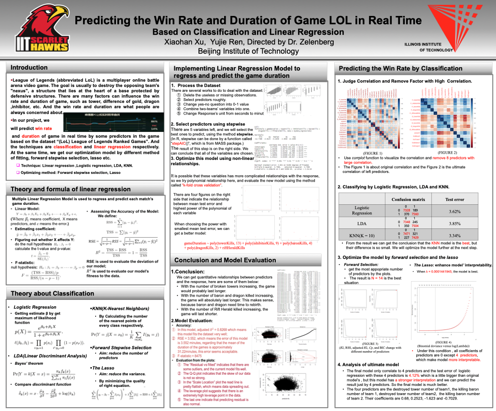

# IITGamePrediction

This is a repository for the project "Predicting the Win Rate and Duration of Game LOL in Real Time", which was done during summer research in Illinois Institute of Technology.

## Introduction 

League of Legends (abbreviated LoL) is a multiplayer online battle arena video game. The goal is usually to destroy the opposing team's "nexus", a structure that lies at the heart of a base protected by defensive structures. There are many factors can influence the win rate and duration of game, such as tower, difference of gold, dragon ,inhibitor, etc. And the win rate and duration are what people are always concerned about.

In our project, we predict win rate and duration of game in real time by some predictors in the game based on the dataset “(LoL) League of Legends Ranked Games”. And the techniques are classification and linear regression respectively. At the same time, we get our optimization model by different methods of fitting, forward stepwise selection, lasso etc.

The poster of our project is shown as follows, and for more details, please see the file `Poster.pdf`.

If you think this project is interesting, please start it. Thanks!

